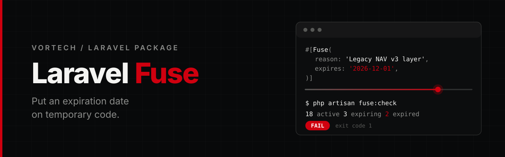

<p align="center">
  
</p>

<p align="center">
  <a href="https://github.com/Vortech-Group/fuse/actions/workflows/tests.yml"></a>
  <a href="https://packagist.org/packages/vortech/laravel-fuse"></a>
  <a href="https://packagist.org/packages/vortech/laravel-fuse"></a>
  <a href="https://packagist.org/packages/vortech/laravel-fuse"></a>
  
  <a href="LICENSE.md"></a>
</p>

<p align="center">
  Track and enforce temporary code and technical debt with <strong>expiring PHP attributes</strong>.<br>
  When the fuse runs out, your CI fails.
</p>

---

## Why

Temporary code has a habit of becoming permanent. A `// TODO remove later` comment is invisible to your tooling, so nobody is ever reminded. Fuse makes the debt machine-readable:

| | `// TODO remove later` | `#[Fuse]` |
|---|---|---|
| Says why the code exists | maybe | required (`reason`) |
| Has a deadline | no | required (`expires`) |
| Has an owner and a ticket | no | optional, can be made mandatory |
| Fails CI when it is overdue | no | yes (`fuse:check`) |
| Production overhead | none | none |

Fuse reads your source statically. It never boots, loads or instantiates your classes, and nothing runs at request time.

## Requirements

- PHP 8.4+
- Laravel 13

## Installation

```bash
composer require vortech/laravel-fuse --dev
```

The service provider is registered automatically through package discovery. Then run the install command to publish the config file:

```bash
php artisan fuse:install
```

Use `--force` to overwrite an existing config file.

PHP only instantiates attributes when something reads them through reflection, so a `--dev` install is safe in production even though your classes carry `#[Fuse]` attributes.

## Usage

### 1. Mark temporary code

```php
use Vortech\Fuse\Attributes\Fuse;

#[Fuse(
    reason: 'Temporary compatibility layer for NAV API v3',
    expires: '2026-12-01',
    owner: 'integrations',
    issue: 'FIS-142',
)]
final class NavGateway
{
    //
}
```

The attribute works on classes, methods, properties (including promoted constructor properties) and functions, and it is repeatable:

```php
final class InvoiceService
{
    #[Fuse(
        reason: 'Temporary retry logic until billing provider fixes timeout issue',
        expires: '2026-11-30',
        owner: 'billing',
        issue: 'BILL-482',
        severity: FuseSeverity::High,
        type: FuseType::Workaround,
        replacement: 'Provider native retry handling',
    )]
    private function retryLegacyRequest(): void
    {
        //
    }
}
```

### 2. Check it in CI

```bash
php artisan fuse:check
```

```text
Fuse check

  ✓ 18 active
  ⚠ 3 expiring
  ✗ 2 expired

FAIL

FAILING

[HIGH] app/Services/NavGateway.php:12
Temporary compatibility layer for NAV API v3

  Expired 2026-12-01
  Target       App\Services\NavGateway
  Owner        integrations
  Issue        FIS-142
```

That is all. There is no database to set up and no dashboard to run.

### Metadata

| Argument | Required | Description |
|---|---|---|
| `reason` | yes | Why the code exists. |
| `expires` | yes | Expiration date, strictly `YYYY-MM-DD`. Relative dates such as `tomorrow` are rejected. |
| `owner` | no | Person, team or domain responsible. |
| `issue` | no | Ticket or issue reference, e.g. `FIS-142`, `#142` or a URL. |
| `severity` | no | `FuseSeverity::Low`, `Medium` (default), `High` or `Critical`. |
| `type` | no | `FuseType::TechnicalDebt` (default), `Workaround`, `Temporary`, `Deprecated`, `Migration` or `Fallback`. |
| `replacement` | no | What is going to replace the code. |
| `created` | no | Creation date, `YYYY-MM-DD`. |

Values must be literals (strings, `null` and enum cases), because Fuse reads your code statically instead of running it.

An item **expires on its `expires` date**: from that day on it counts as expired. Items inside the warning window (`warn_within_days`, 14 by default) count as expiring.

## Commands

All commands accept `--no-cache` to ignore the scan cache.

### `fuse:check`

The command to run in CI.

```bash
php artisan fuse:check
php artisan fuse:check --fail-within=7
php artisan fuse:check --severity=high
php artisan fuse:check --format=json
php artisan fuse:check --format=github
```

| Exit code | Meaning |
|---|---|
| `0` | Success |
| `1` | An item expired (or expires within `--fail-within` days) at or above the severity threshold |
| `2` | Invalid Fuse metadata or configuration: bad date, unknown enum case, missing required owner or issue |
| `3` | Scanner failure, e.g. a file that cannot be parsed |

- `--fail-within=N` also fails for items that expire within N days. Useful on release branches. Defaults to `fuse.fail_within_days`.
- `--severity=` only lets items of at least that severity fail the check. Defaults to `fuse.fail_at_severity`.
- Expired items below the threshold, and items that are merely expiring, are reported as warnings.
- `--format=github` prints workflow commands, so GitHub Actions shows annotations directly on the source files. `--format=json` prints a machine-readable report.

### `fuse:list`

```bash
php artisan fuse:list
php artisan fuse:list --expired
php artisan fuse:list --expiring=14
php artisan fuse:list --owner=payments
php artisan fuse:list --severity=high   # high and critical
php artisan fuse:list --type=workaround
php artisan fuse:list --json
```

### `fuse:install`

Publishes `config/fuse.php`. Pass `--force` to overwrite an existing file.

### `fuse:doctor`

Checks the setup and the metadata: configuration, scan paths, parser failures, invalid dates, unsupported enum values, missing owners or issues, malformed issue references, duplicated attributes and items that have been expired for over a year.

### `fuse:stats`

Totals plus breakdowns by status, severity, type and owner.

## GitHub Actions

```yaml
name: Fuse

on:
  pull_request:
  push:
    branches: [main]

jobs:
  fuse:
    runs-on: ubuntu-latest

    steps:
      - uses: actions/checkout@v4

      - uses: shivammathur/setup-php@v2
        with:
          php-version: '8.4'

      - run: composer install --no-interaction --prefer-dist

      - run: php artisan fuse:check --format=github --fail-within=7
```

Expired items become errors, items about to expire become warnings.

## Configuration

Publish the config with `php artisan fuse:install` (or `php artisan vendor:publish --tag=fuse-config`), then edit `config/fuse.php`:

| Key | Default | Description |
|---|---|---|
| `paths` | `[app_path()]` | Directories or files to scan. |
| `ignore` | storage, vendor, bootstrap/cache | Paths to skip. |
| `warn_within_days` | `14` | Items expiring within this window are "expiring". |
| `fail_within_days` | `0` | `fuse:check` also fails for items expiring within this window. |
| `fail_at_severity` | `FuseSeverity::Low` | Minimum severity that can fail CI (enum case or string). |
| `require_owner` | `false` | Items without `owner` are invalid. |
| `require_issue` | `false` | Items without `issue` are invalid. |
| `cache.enabled` | `true` | Cache parsed metadata per file. |
| `cache.store` | `null` | Cache store to use. `null` is the default store. |
| `cache.ttl` | `3600` | Cache lifetime in seconds. |

## Programmatic API

```php
use Vortech\Fuse\FuseManager;

$fuse = app(FuseManager::class);

$fuse->scan();               // FuseCollection of every item
$fuse->expired();
$fuse->expiringWithin(14);
$fuse->result();             // ScanResult: items, problems and the number of files scanned
$fuse->check();              // CheckReport, what fuse:check works with
```

The `Vortech\Fuse\Facades\Fuse` facade exposes the same methods. `FuseCollection` is immutable and offers `expired()`, `expiring()`, `active()`, `expiringWithin($days)`, `critical()`, `severityAtLeast($severity)`, `ownedBy($owner)` and `ofType($type)`.

## Good to know

- **Static analysis only.** Fuse parses your files with [nikic/php-parser](https://github.com/nikic/PHP-Parser). Scanning has no side effects and needs no booted dependencies. Runtime enforcement is intentionally not part of Fuse.
- **Scan cache.** Parsed metadata is cached per file and invalidated when the file's modification time or size changes. Statuses are always computed fresh, so a cached item still expires on time.
- **Invalid attributes are errors, not silence.** A `#[Fuse]` with a malformed date or an unknown enum case is reported as a problem and fails `fuse:check` with exit code `2`.

## Testing

```bash
composer test
composer analyse
composer format
```

The suite uses [Pest](https://pestphp.com) and requires PHP 8.4+ to run.

## Changelog

See [CHANGELOG](CHANGELOG.md) for what has changed recently.

## Security

If you discover a security issue, please email [mate@vortech.hu](mailto:mate@vortech.hu) instead of using the issue tracker.

## Credits

- Mate Papp, Developer @ Vortech

## License

The MIT License (MIT). See the [License File](LICENSE.md) for more information.

---

<p align="center">
  <a href="https://vortech.hu">
    <picture>
      <source media="(prefers-color-scheme: dark)" srcset="art/logo-white.png">
      
    </picture>
  </a>
</p>
